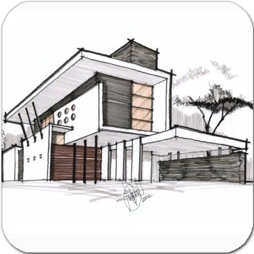
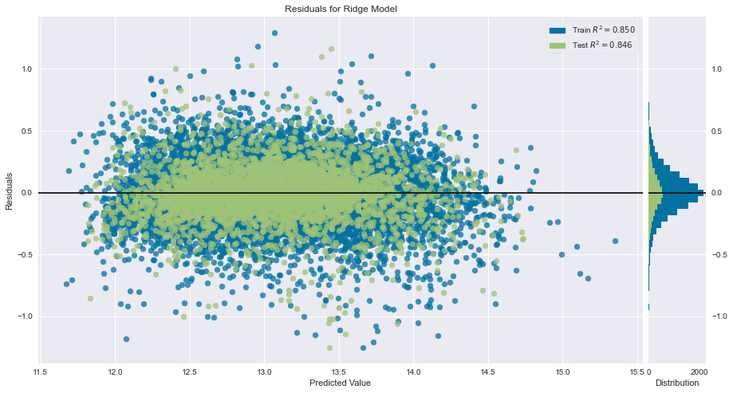
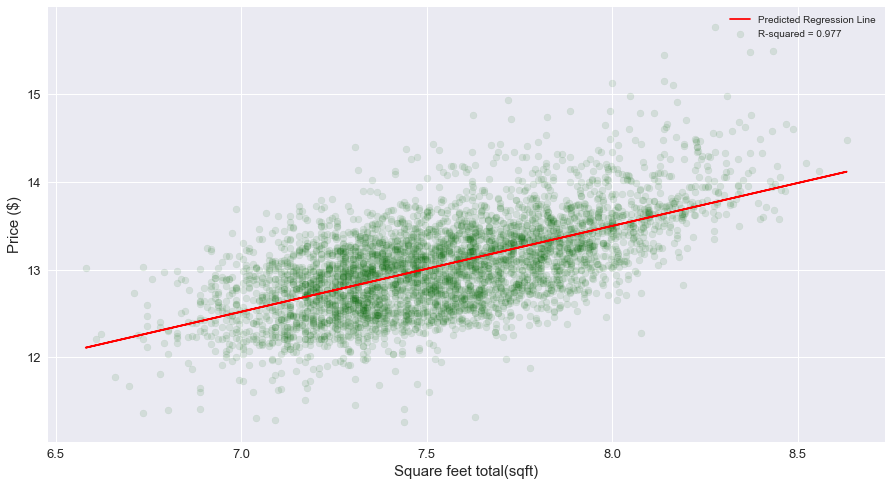
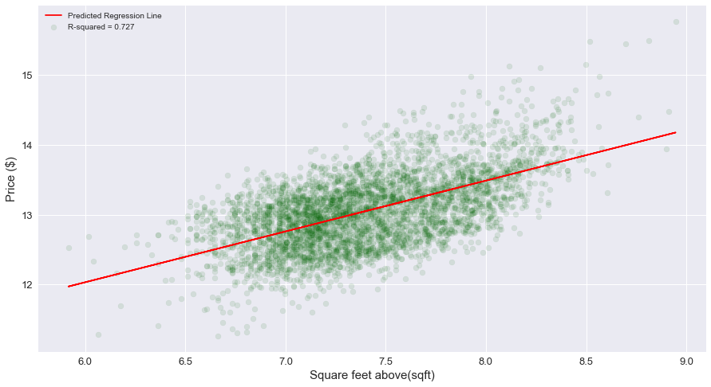
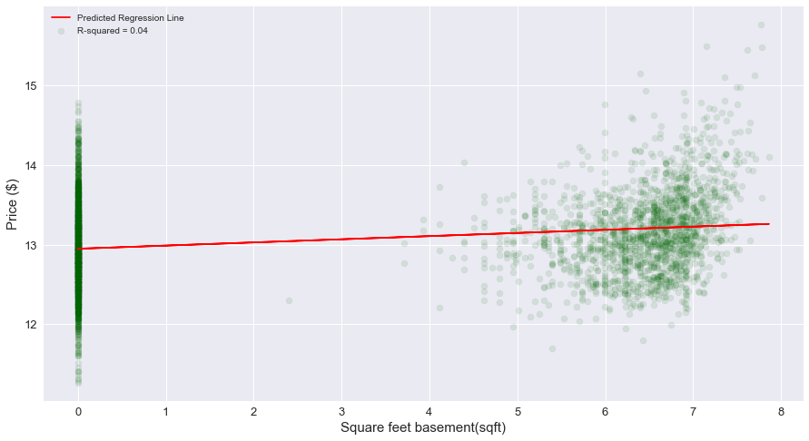
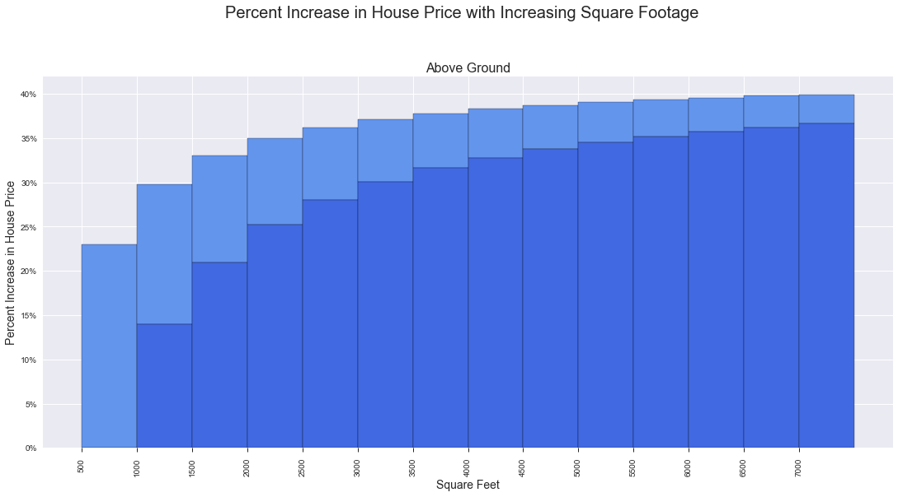
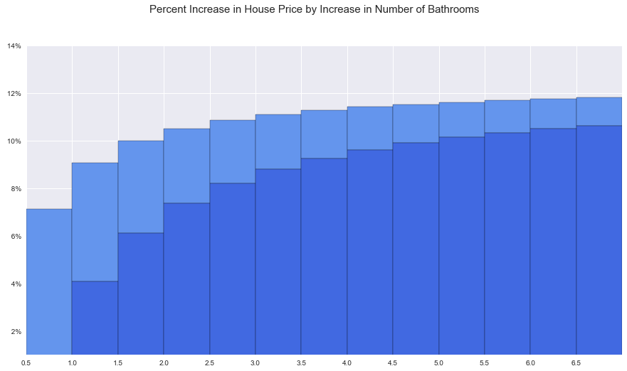

# King County Housing Analysis

**Authors**: Moses Kuria

## Overview

King County Real estate services wants to contract a construction company to build some houses in King County and the area of Seattle.Before it can do that, it wants to know what kind of houses to build to maximise profit by knowing the market value of the built house. As house prices are decided by a variety of factors, King County Real estate services wants to know exactly what those factors are to maximise profit. I am charged with exploring exactly what kind of houses have the best market prices and what it is that makes them so valuable. To do this, I will analyse data from the King County Housing datasets to draw actionable insights that they can use.

## Business Problem

The problem here is that King County Real Estate Services does not know exactly what kind of houses to build for it's customer base. It wants to know how different houses are priced and the likely factors that are driving that price evaluation. To do this, it must study the data and use different parameters to see what affects price the most. This allows them to predict the price in the future and build houses that will fetch revenue maximising profit.

## Data

This dataset contains house sale prices for King County, which includes Seattle. It includes homes sold between May 2014 and May 2015. The dataset includes basic house information such as the number of bedrooms & bathrooms, total area of the living space (divided into basement and above ground) & the lot, and year it was built, sales information like price & number of times it was viewed, and neighborhood information, like zipcode and information about the house and lot size of the 15 nearest neighbors.

I will use this data to build a model that will predict house prices based on the available variables.

## Methods

Before I could utilize the variables aforementioned, the data had to undergo a 
process of preparation to ensure that the insights I would generate would be as 
accurate as possible. This included:
● Dropping rows with empty values
● Making sure the data is in the correct format
● Creating variables necessary for analysis
● Normalizing the data and scaling it.
● Using linear regression to model the data

## Results
## Visualizations
The R-squared of our model

Regression plot of price and Total Square Feet

Regression plot of price and Square Feet Above Ground

Regression plot of price and Square Feet of Basement

Increase in percent price with Increase in Square Footage

Increase in percent price with Increase in No of Bathrooms

## Evaluation

As a whole, approximately 85% of the variations in dependent variable, price, are explained by the independent variables in our model. The model takes into account features such as square feet of the living space, number of bedrooms, bathrooms and so on to try and approximate the best combination of features that will accurately predict the price of a house. We started the model off by taking in the raw features and seeing how well it would predict future prices. We achieved an R-squared value of 0.75, however, we did not satisfy the requirement that our residuals must be normally distributed. This was shown when we plotted our residuals and saw that our data has skew and it was heteroskedastic. We then proceeded to improve our model by noamlizing our underlying data and scaling it to reduce the effect that some of the features have on the effectiveness of our model. Doing this, we were able to achieve an R-squared value of 0.85, expalaining 85% of the variations in the price of our houses. Additionally, we can look at the effect of individual features in our model. Features like square feet seem to have more effect on the price than other features. More analysis is needed.

## Conclusion

King County Real Estate Services should focus on: 

1. Building houses with more square feet above the ground and more square feet in general.
2. Building houses with 1-3 bathrooms for more economy.
3. Building houses with a higher grade.
4. Renovating existing houses to achieve higher grade.

## For More Information

Please review our full analysis in [our Jupyter Notebook](./student.ipynb) or our [presentation](./King%20County%20Housing%20Analysis%20Presentation.pdf).

For any additional questions, please contact **Moses Kuria & moses.kuria@student.moringaschool.com**

## Repository structure
├── data                           
├── images         
├── King-County-Housing-Analysis.ipynb    
├── CONTRIBUTING.md              
├── halfway-there.gif	         
├── King-County-Housing-Analysis-Presentation.pdf                                               
├── LICENSE.md        
├── README.md
